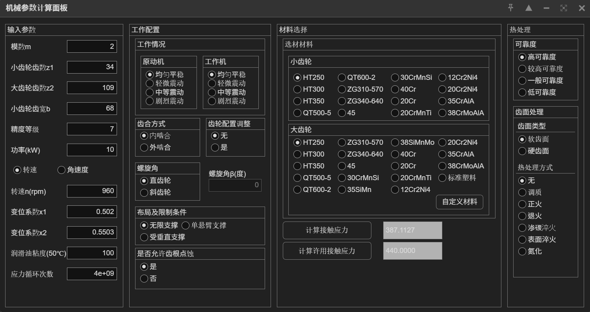

# Gear Stress Calculator

A MATLAB GUI application for calculating gear contact stress and allowable stress according to GB/ISO standards. This tool helps engineers analyze gear designs by computing actual contact stress (σH) and allowable contact stress ([σH]) for both straight and helical gears.

## Features

- **Comprehensive Input Parameters**: 
  - Gear geometry (module, number of teeth, face width)
  - Operating conditions (power, speed, accuracy grade)
  - Material selection for pinion and gear
  - Heat treatment options
  - Reliability settings

- **Calculation Capabilities**:
  - Contact stress calculation (σH)
  - Allowable contact stress calculation ([σH])
  - Support for both internal and external gear meshing
  - Support for straight and helical gears

- **Material Database**:
  - Predefined materials (HT250, HT300, QT600-2, various steel grades, etc.)
  - Custom material input option
  - Automatic material property calculation based on heat treatment

- **User-Friendly Interface**:
  - Organized panel layout
  - Real-time calculation results
  - Chinese language interface

## Screenshots




## Usage

1. Open MATLAB and navigate to the project directory
2. Run the calculator by calling:
   ```matlab
   chineseMachineryPanel()
   ```
3. Fill in the input parameters in the left panel:
   - Module (m)
   - Number of teeth (z1, z2)
   - Face width (b)
   - Power (kW)
   - Speed (rpm)
   - Other geometric and operating parameters

4. Configure working conditions in the middle panel:
   - Select prime mover and working machine types
   - Choose meshing type (internal/external)
   - Select gear type (straight/helical)
   - Set layout and support conditions

5. Select materials in the right panel:
   - Choose materials for pinion and gear
   - Configure heat treatment options
   - Set reliability requirements

6. Click the calculation buttons:
   - **计算接触应力** (Calculate Contact Stress) - Computes actual contact stress
   - **计算许用接触应力** (Calculate Allowable Contact Stress) - Computes allowable stress

## Technical Details

The calculator implements gear stress calculations according to GB/ISO standards:

- **Contact Stress Formula**: 
  - External meshing: σH = Ze × Zh × Zab × √(Ft/b/d1 × (u+1)/u × KA×KV×KHa×KHb)
  - Internal meshing: σH = Ze × Zh × Zab × √(Ft×(u-1)/(b×d1×u) × KA×KV×KHa×KHb)

- **Allowable Stress Formula**:
  - [σH] = σHlim × ZNT × ZLV × ZW × ZX × ZR / SF

Where:
- Ze: Elasticity coefficient
- Zh: Zone factor
- Zab: Contact ratio factor
- ZNT: Life factor
- ZW: Speed factor
- ZX: Size factor
- ZR: Reliability factor
- KA, KV, KHa, KHb: Load factors

## Requirements

- MATLAB R2016b or later (for App Designer/uifigure support)
- No additional toolboxes required

## Files

- `Calculator_zh.m` - Main calculator function (Chinese interface)
- `Calculator.m` - Alternative calculator function
- `screenshot.png` - Application screenshot
- `screenshot1.png` - Additional application screenshot

## License

This project is provided as-is for educational and engineering purposes.

